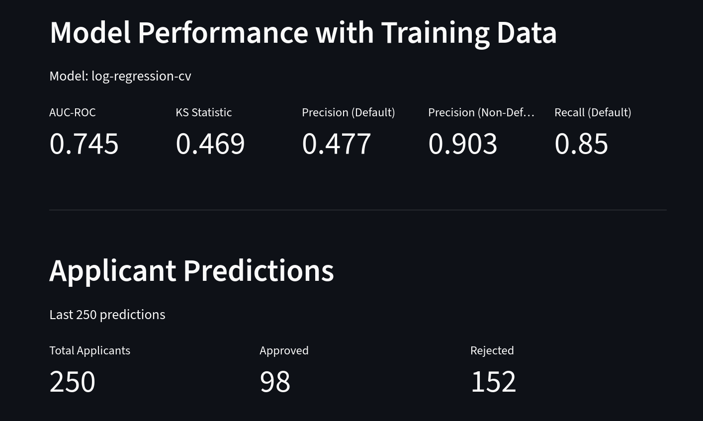
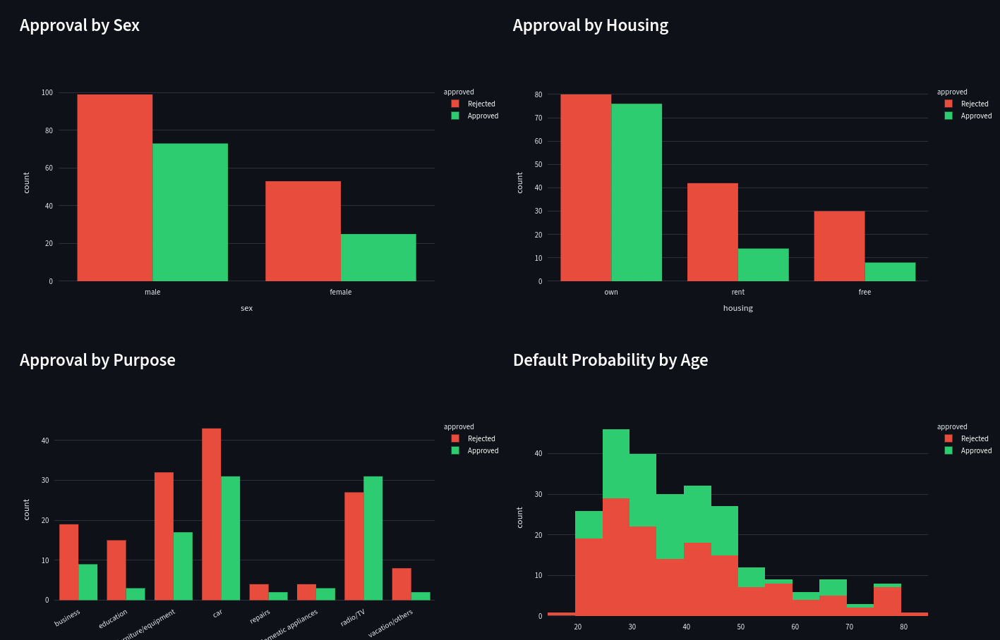
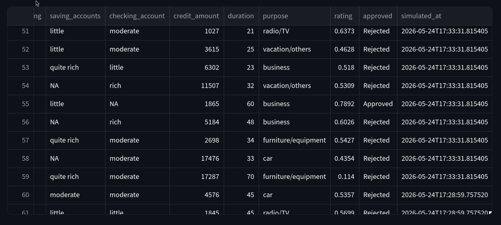
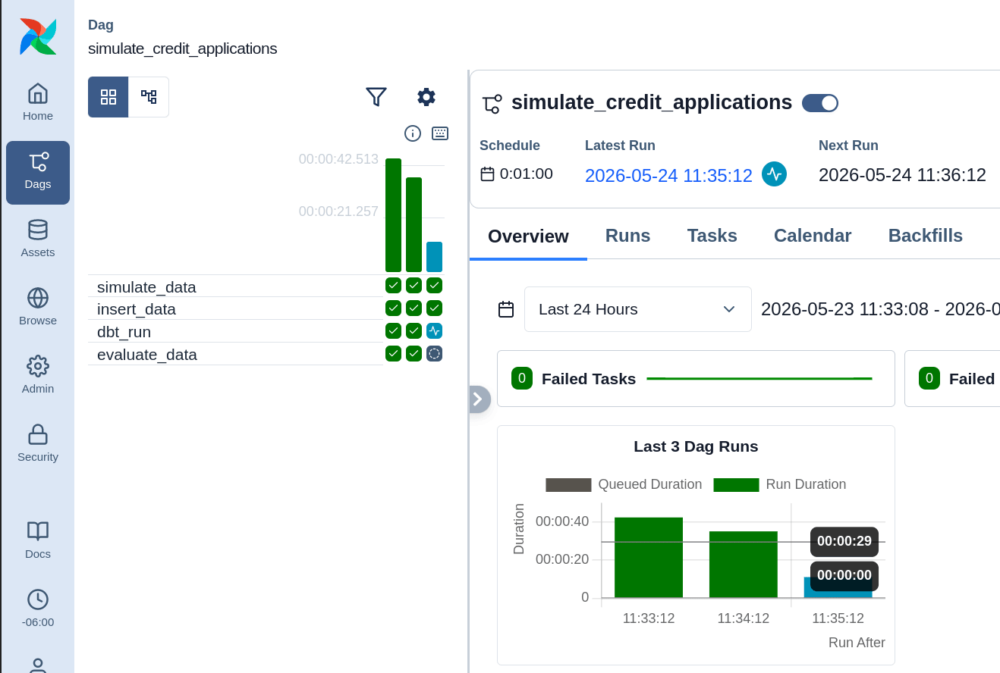
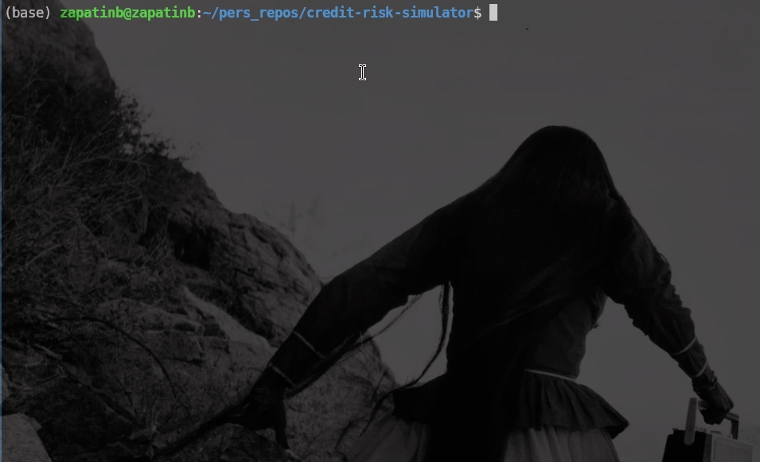
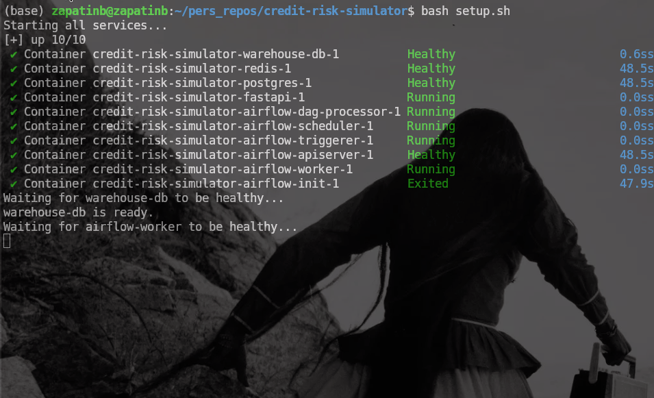
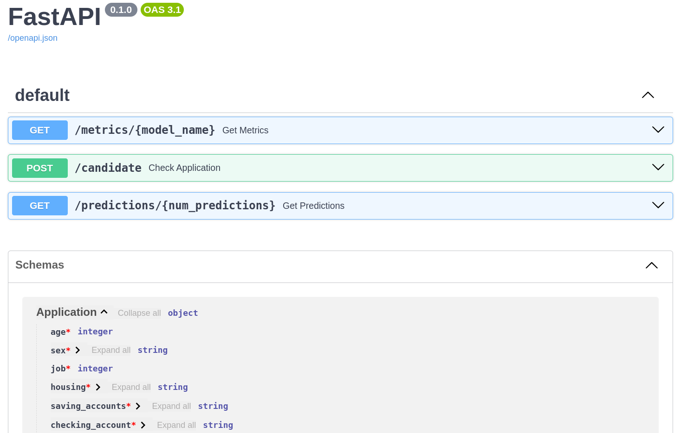

# Credit Default ML Scoring Pipeline

This repository provides an example of a machine learning pipeline to predict customer credit default based on the applicant's general profile (e.g. sex, age, housing, and job skill level) and credit application details (duration and loan amount). The pipeline uses past customer default history to train machine learning models, ingests simulated loan applications, and calculates default probabilities per application. Finally, the pipeline classifies each new applicant as "approved" or "not approved" given a probability threshold.

Model metrics (AUC-ROC, KS Statistic, Precision, Recall), single applicant predictions and simulation results are available via FastAPI.
A summary of model performance and recent simulations ar also viewable through a Streamlit Dashboard.


<br>

<br>

<br>


## Architecture

```
raw_applicants (Postgres)
    → dbt (staging → intermediate → features)
    → train_models.py → model.pkl

Airflow DAG (scheduled):
    generate_applicants → dbt_run → evaluate_data
    → updates raw_applicants with rating + approved

FastAPI:
    POST /candidate              → real-time single applicant scoring
    GET  /predictions/{n}        → batch results from Airflow
    GET  /metrics/{model_name}   → model evaluation metrics

Streamlit:
    → pulls from FastAPI
    → displays metrics + approval charts
```

## Setup

**Requirements:** Docker, Docker Compose

Clone the repository:

```bash
git clone https://github.com/yourname/credit-risk-simulator
cd credit-risk-simulator
```

Run the setup script:

```bash
bash setup.sh
```

This will:
- Start all Docker services (Postgres, Airflow, FastAPI)
- Load the German Credit dataset into Postgres
- Run dbt transformations to build the feature table
- Train the configured ML model and save `model.pkl`

Once complete:
- **Airflow UI:** http://localhost:8080 (user: `airflow`, password: `airflow`)
- **FastAPI docs:** http://localhost:8000/docs
- **Streamlit Dashboard:** http://localhost:8501/

To start simulating new applications, open the Airflow UI and trigger the `simulate_credit_data` DAG. This will generate new applicants, insert them into Postgres, run dbt transformations, and score each applicant with the trained model.

To test the API, open the FastAPI docs at http://localhost:8000/docs:

| Endpoint | Description |
|----------|-------------|
| `POST /candidate` | Real-time scoring for a single applicant |
| `GET /predictions/{num_predictions}` | Batch results from the last Airflow run |
| `GET /metrics/{model_name}` | Evaluation metrics for a trained model |


<br>

<br>

<br>


---

## Configuration

Model selection and feature configuration are controlled via `config.yml` in the project root.

### Database connection

```yaml
source:
  database: 'postgres'
  user: 'postgres'
  password: 'postgres'
  host: 'warehouse-db'   # Docker service name — do not change
  port: '5432'
  model: 'fet__applicants'  # dbt feature table used for scoring
```

### Selecting a model

The pipeline uses the first model with `active: true`. To switch models, set `active: true` on the desired model and `active: false` on the other, then retrain:

```yaml
models:
  log-regression-cv:
    active: true    # ← this model will be used
  decision-tree:
    active: false
```

Retrain after switching:

```bash
docker compose exec airflow-worker python /opt/airflow/dags/src/train_models.py
```

### Model fields

| Field | Description |
|-------|-------------|
| `active` | Whether this model is selected for training and scoring |
| `features` | Columns passed to the model — must exist in `fet__applicants` |
| `scale.features` | Numeric columns to apply StandardScaler to |
| `one-hot.features` | Categorical columns to one-hot encode |
| `one-hot.drop-first` | Drop first dummy column — use `true` for logistic regression, `false` for tree models |
| `target` | Target column for training |
| `threshold` | Probability cutoff for approval — applicants with default probability above this are rejected |

### Threshold tuning

The `threshold` controls the tradeoff between precision and recall. Raising it approves more applicants but increases default risk. Lowering it is more conservative. The optimal threshold is determined during model evaluation — see `models/{model_name}-current.json` for metrics at the current threshold.

## Dataset

The project uses the [Statlog German Credit dataset](https://archive.ics.uci.edu/dataset/144/statlog+german+credit+data), a classic benchmark dataset containing 1,000 past loan applicants classified as good or bad credit risks. Each record includes demographic information (sex, age, housing, job skill level) and credit application details (duration, loan amount).

## Approach

The pipeline trains two ML models on the historical dataset:
- Logistic Regression
- Decision Tree

Both models are also calibrated using a sigmoid function to produce better-calibrated probability outputs. Model parameters and selected features are specified in `.yaml` files. Model selection, parameter tuning, and feature selection are done beforehand using Jupyter notebooks.

During each training phase, the pipeline outputs precision, recall, AUC-ROC score, and KS statistic for each model given the chosen parameters and features.

New loan applications are simulated and scored through an Apache Airflow DAG, which orchestrates applicant generation, feature extraction, and model scoring. Each applicant is assigned a default probability and classified as "approved" or "not approved" given a configurable threshold. Predictions and model evaluation metrics are served via a FastAPI endpoint and visualized through a Streamlit dashboard.

## Technology Used

- **PostgreSQL** for data warehousing
- **Docker Compose** for full project containerization
- **Apache Airflow** for pipeline orchestration
- **dbt** for feature extraction, data cleaning, and transformations
- **scikit-learn** for model training, evaluation, and predictions
- **FastAPI** for serving predictions and model evaluation metrics
- **seaborn** and **plotly** for visualization
- **Streamlit** for dashboarding

## Repository Structure

```text
credit-risk-simulator/
│
├── api/
│   └── main.py                         # FastAPI application
│
├── airflow/
│   ├── config/
│   │   └── airflow.cfg                 # Airflow configuration
│   └── dags/
│       └── simulate_credit_data.py     # Scoring pipeline DAG
│
├── dbt_transform/
│   ├── dbt_project.yml
│   ├── profiles.yml
│   └── models/
│       ├── 01_staging/
│       │   └── stg__applicants.sql
│       ├── 02_intermediate/
│       │   ├── int__base_features.sql
│       │   ├── int__credit_exposure.sql
│       │   ├── int__liquidity.sql
│       │   └── int__profile.sql
│       └── 03_marts/
│           └── fet__applicants.sql     # Final feature table
│
├── src/
│   ├── train_models.py                 # Model training entry point
│   ├── credit_sim.py                   # Applicant simulation
│   └── utils/
│       ├── feature_engineering.py      # Mirrors dbt transformations for real-time scoring
│       ├── transform_data.py           # Scaling and encoding
│       ├── evaluate_model.py           # Model evaluation metrics
│       ├── extract_data.py             # Data extraction utilities
│       └── build_models.py             # Model building utilities
│
├── streamlit/
│   └── app.py                          # Streamlit dashboard
│
├── models/                             # Trained model artifacts (generated by setup.sh)
│   ├── log-regression-cv.pkl
│   ├── log-regression-cv_features.pkl
│   └── log-regression-cv-current.json
│
├── notebooks/                          # Exploratory analysis and model selection
│   ├── 01_exploratory_analysis.ipynb
│   ├── 02_log_regression.ipynb
│   └── 03_decision_tree.ipynb
│
├── data/
│   ├── german_credit_data.csv          # Raw dataset
│   └── seed.sql                        # Database initialization
│
├── config.yml                          # Model and pipeline configuration
├── docker-compose.yaml
├── Dockerfile                          # Airflow image
├── Dockerfile.api                      # FastAPI image
└── setup.sh                            # One-command setup
```

## Learning Objectives

This repository is designed primarily as a learning and documentation project focused on:
- Machine learning theory and scalable implementation with scikit-learn
- PostgreSQL database administration and containerization with Docker
- Airflow deployment and containerization
- Airflow DAG structuring
- Efficient and scalable dbt project and SQL scripting
- API integration in Python using FastAPI
- Basic dashboarding with Streamlit

While at the time of building this I had experience with most of the tools used, this project allowed me to brush up on best practices and delve deeper into the fundamentals. For example, deploying a PostgreSQL server from scratch required a review of the server's internal database, SQL scripting to build the initial framework, and administration of user privileges. Deploying the project from a Docker container required a review of database exposure through local ports.

## References

- Reis, J., & Housley, M. (2022). *Fundamentals of Data Engineering.* O'Reilly.<br>
  <https://www.oreilly.com/library/view/fundamentals-of-data/9781098108298/>
- Obe, R., & Hsu, L. (n.d.). *PostgreSQL: Up and Running.* O'Reilly.<br>
  <https://learning.oreilly.com/library/view/postgresql-up-and/9798341660885/ch01.html#sect2_pgAdmin>
- Müller, A. C., & Guido, S. (2016). *Introduction to Machine Learning with Python.* O'Reilly.<br>
  <https://www.oreilly.com/library/view/introduction-to-machine/9781449369880/>
- Géron, A. (2022). *Hands-On Machine Learning with Scikit-Learn, Keras, and TensorFlow* (3rd ed.). O'Reilly.<br>
  <https://learning.oreilly.com/library/view/hands-on-machine-learning/9781491962282/>
- *dbt Documentation.*<br>
  <https://docs.getdbt.com/docs/introduction>
- *PostgreSQL Documentation.*<br>
  <https://www.postgresql.org/docs/>
- *Docker documentation*<br>
  <https://docs.docker.com/>
- *scikit-learn Documentation.*<br>
  <http://scikit-learn.org/stable/>
- *GeeksforGeeks.*<br>
  <https://www.geeksforgeeks.org/>
- *DataCamp.*<br>
  <https://www.datacamp.com/>
